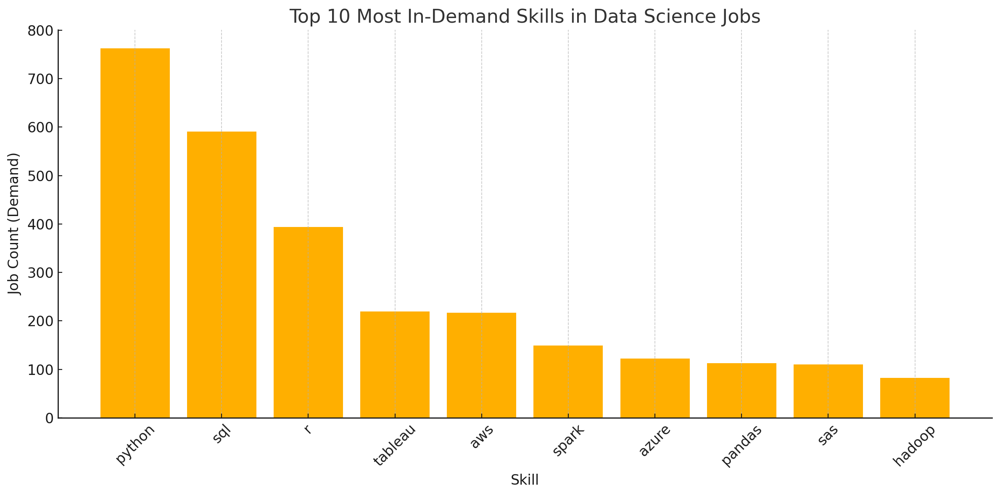

-- UPDATE content later 
# Introduction
Welcome to my SQL Portfolio Project  A data-driven exploration of the job market for Data Analyst roles.
This project analyzes real job postings to uncover:
The highest-paying data analyst positions
The most in-demand skills
Which skills correlate with higher salaries
The optimal combination of skills that maximize market value
Check out my SQL queries here: [Project_sql_1 folder](/Project_sql_1/)

# Background
This project was created to analyze the data analyst job market and understand the relationship between skills, salaries, and employer demand. The goal was to identify high-paying roles, in-demand skills, and the skills that offer the greatest market value.

The analysis focuses on five key questions:

1- What are the top-paying data analyst jobs?

2- What skills do these top-paying roles require?

3- Which skills are most in demand for data analysts?

4- Which skills are associated with higher salaries?

5- What are the most valuable skills to learn to maximize job-market opportunities?

📌 Dataset used in this project is a curated collection of real job postings prepared for data analytics research and practice.

# Tools I Used
**SQL** (PostgreSQL): Used to query, clean, aggregate, and analyze the job posting data.

**PostgreSQL** Database : Hosted and managed the dataset for all analytical queries.

**Visual Studio Code** : Used as my main SQL development environment through SQLTools plugin.

**Git & GiHUB** :Essential for version control, project tracking, and sharing SQL scripts and analysis in a clean, organized, and collaborative format.
# The Analysis
Each query for this project aimed at investigating specific aspects of the data analyst job market. Here’s how I approached each question:

### 1. Top Paying Data Analyst Jobs
```sql
SELECT 
    job_id,
    job_title,
    job_location,
    job_schedule_type,
    salary_year_avg,
    job_posted_date
FROM
    job_postings_fact
WHERE
    job_title = 'Data Scientist'
    AND salary_year_avg IS NOT NULL
    AND job_location = 'Anywhere'
ORDER BY
    salary_year_avg DESC
LIMIT 10;
``` 


### 2. Skills for Top Paying Jobs
To understand what skills are required for the top-paying jobs, I joined the job postings with the skills data, providing insights into what employers value for high-compensation roles.
```sql
WITH top_paying_jobs AS (
    SELECT
        job_id,
        job_title,
        salary_year_avg
    FROM
        job_postings_fact
    WHERE
        job_title_short = 'Data Scientist'
        AND salary_year_avg IS NOT NULL
        AND job_location = 'Anywhere'
    ORDER BY
        salary_year_avg DESC
    LIMIT 10
)
SELECT
    top_paying_jobs.job_id,
    top_paying_jobs.job_title,
    top_paying_jobs.salary_year_avg,
    skills_dim.skills
FROM
    top_paying_jobs
    INNER JOIN
    skills_job_dim ON top_paying_jobs.job_id = skills_job_dim.job_id
    INNER JOIN
    skills_dim ON skills_job_dim.skill_id = skills_dim.skill_id
ORDER BY
    top_paying_jobs.salary_year_avg DESC;
```


### 3. In-Demand Skills for Data Analysts
This query helped identify the skills most frequently requested in job postings, directing focus to areas with high demand.

```sql
SELECT
  skills_dim.skills,
  COUNT(skills_job_dim.job_id) AS demand_count
FROM
  job_postings_fact
  INNER JOIN
    skills_job_dim ON job_postings_fact.job_id = skills_job_dim.job_id
  INNER JOIN
    skills_dim ON skills_job_dim.skill_id = skills_dim.skill_id
WHERE
  job_postings_fact.job_title_short = 'Data Scientist'
GROUP BY
  skills_dim.skills
ORDER BY
  demand_count DESC
LIMIT 5;
```

 ### 4. Skills Based on Salary

Exploring the average salaries associated with different skills revealed which skills are the highest paying.

```sql
SELECT
  skills_dim.skills AS skill,
  ROUND(AVG(job_postings_fact.salary_year_avg),2) AS avg_salary
FROM
  job_postings_fact
INNER JOIN
  skills_job_dim ON job_postings_fact.job_id = skills_job_dim.job_id
INNER JOIN
  skills_dim ON skills_job_dim.skill_id = skills_dim.skill_id
WHERE
  job_postings_fact.job_title_short = 'Data Scientist'
  AND job_postings_fact.salary_year_avg IS NOT NULL
GROUP BY
  skills_dim.skills
ORDER BY
  avg_salary DESC;
  ```

### 5. Most Optimal Skills to Learn

Combining insights from demand and salary data, this query aimed to pinpoint skills that are both in high demand and have high salaries, offering a strategic focus for skill development.
```sql
WITH skills_demand AS (
  SELECT
    skills_dim.skill_id,
    skills_dim.skills,
    COUNT(skills_job_dim.job_id) AS demand_count
  FROM
    job_postings_fact
    INNER JOIN
    skills_job_dim ON job_postings_fact.job_id = skills_job_dim.job_id
    INNER JOIN
    skills_dim ON skills_job_dim.skill_id = skills_dim.skill_id
  WHERE
    job_postings_fact.job_title_short = 'Data Scientist'
    AND job_postings_fact.salary_year_avg IS NOT NULL
    AND job_postings_fact.job_location = 'Anywhere'
  GROUP BY
    skills_dim.skill_id
),
average_salary AS (
  SELECT
    skills_job_dim.skill_id,
    AVG(job_postings_fact.salary_year_avg) AS avg_salary
  FROM
    job_postings_fact
    INNER JOIN
    skills_job_dim ON job_postings_fact.job_id = skills_job_dim.job_id
  WHERE
    job_postings_fact.job_title_short = 'Data Analyst'
    AND job_postings_fact.salary_year_avg IS NOT NULL
    AND job_postings_fact.job_location = 'Anywhere'
  GROUP BY
    skills_job_dim.skill_id
)
SELECT
  skills_demand.skills,
  skills_demand.demand_count,
  ROUND(average_salary.avg_salary, 2) AS avg_salary
FROM
  skills_demand
  INNER JOIN
  average_salary ON skills_demand.skill_id = average_salary.skill_id
ORDER BY
  demand_count DESC,
  avg_salary DESC
LIMIT 10;
```



Each query not only served to answer a specific question but also to improve my understanding of SQL and database analysis. Through this project, I learned to leverage SQL's powerful data manipulation capabilities to derive meaningful insights from complex datasets.


# What I Learned
Throughout this project, I strengthened several key SQL and analytical skills:

- **Advanced Query Construction**: Building multi-table SQL queries using `JOIN`, `WHERE`, and `WITH` (CTEs) to organize complex logic clearly.
- **Data Aggregation**: Utilizing `GROUP BY`, `COUNT()`, `AVG()`, and filtering techniques to extract meaningful trends from the dataset.
- **Analytical Thinking**: Translating real-world questions into structured SQL queries that reveal actionable insights.
- **Data Exploration Workflow**: Improving my ability to validate data quality, identify missing values, and ensure accurate analytical results.

# Insights

From the analysis, several key insights emerged:

1. **Top-Paying Data Analyst Jobs**: Remote-friendly data analyst roles show a wide salary range, with some positions offering exceptionally high compensation.
2. **Skills for Top-Paying Jobs**: High-paying roles consistently require strong SQL proficiency, reinforcing SQL as a foundational skill for competitive salaries.
3. **Most In-Demand Skills**: SQL remains the most in-demand skill across the job market, making it essential for anyone pursuing a data analyst career.
4. **Skills Associated with Higher Salaries**: Specialized technical skills—such as SVN and Solidity—tend to be linked with higher average salaries, indicating a premium on niche expertise.
5. **Optimal Skills for Maximizing Market Value**: SQL stands out both in demand and salary potential, positioning it as one of the most valuable skills for data analysts looking to strengthen their market competitiveness.

# Conclusions 
This project strengthened my SQL skills and provided meaningful insights into the data analyst job market. The findings help guide which skills to prioritize for both learning and career growth. By focusing on high-demand and high-value skills, aspiring data analysts can better position themselves in a competitive environment. This analysis also reinforces the importance of continuous learning and staying aligned with emerging trends in the field of data analytics.
